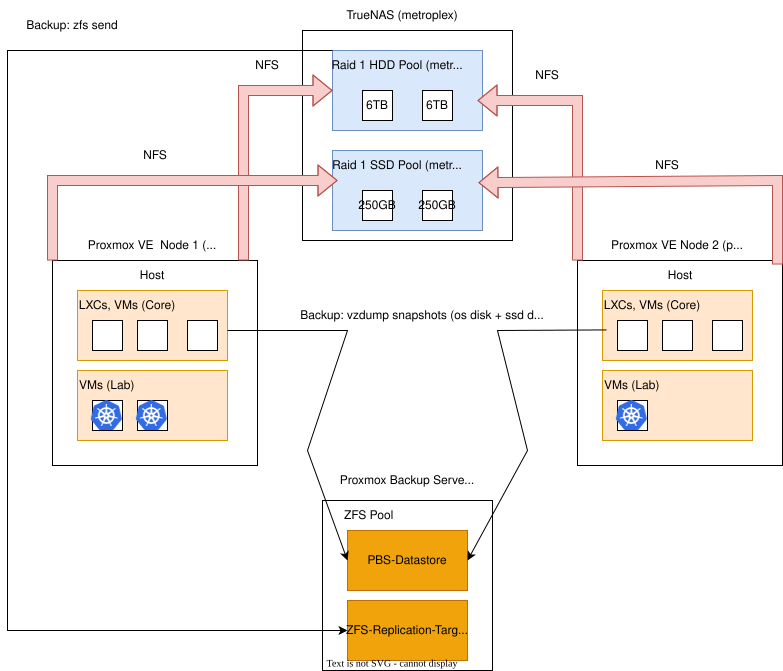

# 0003-shared-infrastructure-design-and-backups

- **Status:** Accepted
- **Date:** 2026-08-09
- **Deciders:** leloco

## Context

We currently operate a single Proxmox VE host (ninja). Due to physical server size constraints, local storage is limited:

- local-lvm (Thin Pool): Stores root disks for core LXCs and VMs.

- Internal 2,5" HDD: Serves as a local bulk storage path on ninja.

## Problem

To expand our environment, we are onboarding a second standalone Proxmox VE host (primus) to run a high-availability, multi-node Kubernetes cluster across both compute hosts.

Relying solely on local storage creates a single point of failure (SPOF) and prevents workload mobility between hosts.

## Decision

### 1. Compute Topology

- **Standalone Hosts:** `ninja` and `primus` run independently without a Proxmox cluster quorum.
- **Core Isolation:** LXCs/VMs that represent core infrastructure run on local disks only for max resiliency.
- **Lab Mobility:** Kubernetes VMs utilize shared storage across both hosts.

### 2. Centralized Storage (TrueNAS - `metroplex`)

- **Protocol:** Shared datasets mounted via NFS to both Proxmox nodes.
- **Tiering:**
  - **`metroplex-fast` (RAID 1 SSD, 2x 250GB):** K8s VM root disks & high-IOPS persistent volumes.
  - **`metroplex-bulk` (RAID 1 HDD, 2x 6TB):** High-capacity bulk data storage.

### 3. Backup Strategy (PBS - `sentinel`)

- **`PBS-Datastore`:** Receives `vzdump` snapshots (OS & SSD disks) from `ninja` and `primus`.
- **`ZFS-Replication-Target`:** Receives direct block-level `zfs send` snapshots from TrueNAS (`metroplex-bulk`).

### 4. Core Components need to be labeled with `always-on`

- Important for running all core components automatically via **PBS-backed Cold Migration Pattern** (See Implications)

### 5. Sync will be disabled on the NFS Dataset (`metroplex-fast`)

- **Filesystem:** ZFS RAID 1 (2x Consumer SSDs with DRAM cache).
- **NFS Sync Optimization:** Set `sync = disabled` on the NFS Dataset.
- **Technical Rationale:** Consumer SSDs lack dedicated Power-Loss Protection (PLP) capacitors. Native synchronous writes via NFS choke IOPS and drastically reduce throughput. Disabling sync delegates write-buffering to system DRAM, achieving near-wire-speed NFS IOPS for Kubernetes persistent volumes and VM root disks.
- **Risk Acceptance:** Without an UPS, a sudden power outage may result in up to 5 seconds of unwritten RAM buffer loss, potentially causing filesystem/database inconsistency. This operational risk is accepted to avoid severe I/O bottlenecks and is mitigated by automated PBS snapshots on `sentinel`.

### 6. Dedicated Physical Storage Network (NAS via NFS).

- - **Physical Isolation:** Proxmox hosts (`ninja`, `primus`) and TrueNAS (`metroplex`) are interconnected via a dedicated, unmanaged 2.5 GbE switch on a separate subnet.
- **Dedicated Bandwidth:** Guarantees full 2.5 GbE wire-speed (~280–300 MB/s) strictly for NFS storage traffic without interfering with LAN/Management traffic on the standard 1 GbE interfaces.
- **Operational Mitigations:**
  - **Power Saving:** USB autosuspend is explicitly disabled on Proxmox hosts to prevent NFS disconnects/I/O timeouts.
  - **MAC-Based Binding:** Network interface names are persistently bound to USB MAC addresses to avoid device index drift across reboots.

## Consequences

### Positive

- **Node Maintenance & Fault Tolerance:** Kubernetes VMs and stateful application workloads can immediately restart or migrate to the secondary host (`primus`/`ninja`) during outages or planned host maintenance, thanks to shared NFS storage.
- **Core Infrastructure Resilience:** Baseline network services stay completely isolated on local storage (`local-lvm`), ensuring they remain operational even if TrueNAS or the storage interconnect experiences downtime.
- **Efficient Backup Architecture:** Deduplicated PBS snapshots cover compute OS/SSD states, while native ZFS replication handles bulk HDD data without choking hypervisor backups.

### Negative / Trade-offs

- **Manual Core Failover:** Core services (like Nginx Proxy Manager) tied to local storage cannot automatically migrate; moving them during host maintenance requires a manual VM/LXC restore or configuration sync on the target host.
- **Single Point of Failure (NAS):** TrueNAS (`metroplex`) becomes a critical dependency for all Kubernetes workloads and shared storage paths.
- **Strict Backup Requirement:** Because core components lack multi-host HA, every local LXC/VM relies entirely on a verified, fast PBS restore strategy for disaster recovery.

### Implications

#### Operational Strategy: Reduce Manual Core Failover:

Since Core Infrastructure LXCs/VMs (e.g., Nginx Proxy Manager) reside on local storage (`local-lvm`) without automated multi-host HA, host maintenance or migration follows a **PBS-backed Cold Migration Pattern**:

1. **Graceful Shutdown:** Stop the target LXC/VM on the primary host (`ninja`).
2. **On-Demand Snapshot:** Trigger a final `vzdump` backup to the Proxmox Backup Server (`sentinel`).
3. **Target Restore:** Restore the container from `sentinel` directly onto the secondary host's local storage (`primus`).
4. **Ip Continuity:** The service retains its MAC/static network configuration, allowing seamless takeover on `primus`.

\*RTO (Recovery Time Objective) should be under 2 minutes.
