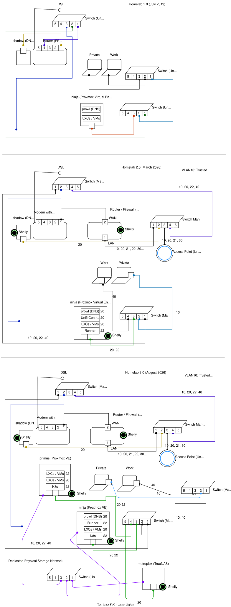

# 0004-homelab-network

- **Status:** Accepted
- **Date:** 2026-08-09
- **Deciders:** leloco

## Context

The current Homelab 2.0 needs to be improved due to new physical machines. A second Proxmox VE node called `primus` and a NAS (`metroplex`).

Relying solely on local storage creates a single point of failure (SPOF) and prevents workload mobility between hosts.

## Decision

