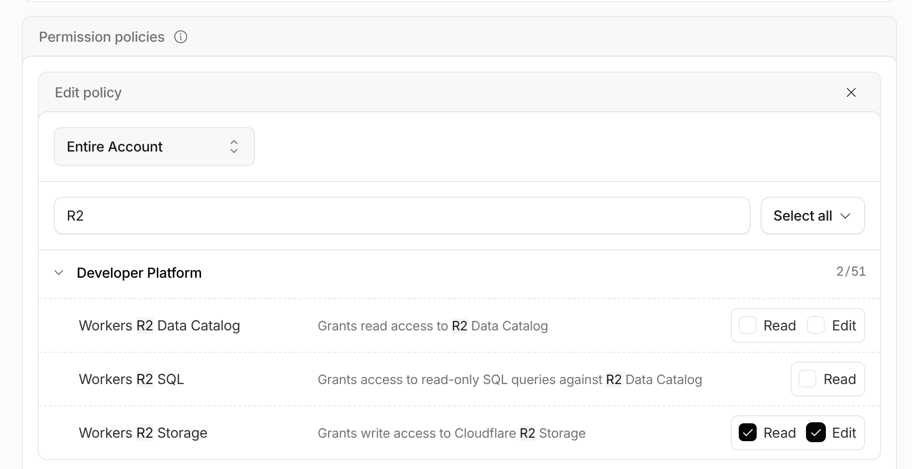

# Cloudflare R2 API Token Setup

To grant OpenTofu and automated workflows full S3-compatible access across all existing and future R2 buckets within the account:

- **Token Type**: Account API Token
- **Scope**: `Entire Account`
- **Permission**: `Developer Platform` → `Workers R2 Storage`
- **Access Level**: `Read` & `Edit`
- **TTL / Expiration**: `No expiration`

---

**Environment Variables & Secrets Mapping**

- `AWS_ACCESS_KEY_ID`: Cloudflare R2 Access Key ID
- `AWS_SECRET_ACCESS_KEY`: Cloudflare R2 Secret Access Key
- `S3_ENDPOINT`: `https://<ACCOUNT_ID>.r2.cloudflarestorage.com`

